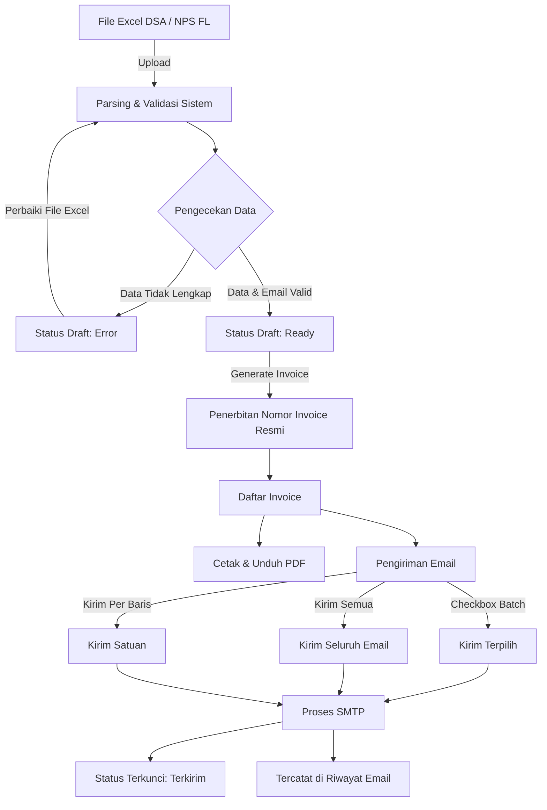

# SCM

Sistem otomasi pengolahan data Excel menjadi invoice resmi dan pengiriman email massal.

---

## Daftar Isi
- [Alur Kerja Sistem](#alur-kerja-sistem)
- [Akun Default](#akun-default)
- [Fitur Utama](#fitur-utama)
- [Panduan Penggunaan](#panduan-penggunaan)
- [Instalasi dan Setup Lokal](#instalasi-dan-setup-lokal)
- [Struktur Data](#struktur-data)

---

## Alur Kerja Sistem



---

## Akun Default

Kredensial login bawaan aplikasi:

| Field | Nilai |
| :--- | :--- |
| URL Login | `http://localhost:8000/login` |
| Email | `admin@scm.com` |
| Password | `password` |

Tersedia tombol **Isi Otomatis Akun Default** pada halaman login untuk pengisian instan.

---

## Fitur Utama

- **Autentikasi & Antarmuka Bersih**: Tampilan monokrom minimalis. Navigasi berbasis shadcn-vue tanpa dropdown bertingkat.
- **Import Excel**: Mendukung format `.xlsx`, `.xls`, dan `.csv` untuk skema DSA (*Direct Sales Agent*) dan NPS FL (*National Program Scheme - Front Line*).
- **Validasi Otomatis**: Pemeriksaan kelayakan data draft, format angka netpay, formula, dan ketersediaan alamat email penerima.
- **Penerbitan Invoice**: Penomoran faktur resmi otomatis, template cetak standar perusahaan, dan download PDF langsung.
- **Pengiriman Email Fleksibel**:
  - Kirim batch via checkbox multi-pilih.
  - Kirim semua invoice sekaligus.
  - Kirim satuan per baris.
  - Proteksi duplikasi: invoice yang telah terkirim otomatis dikunci agar tidak terkirim ulang.
- **Audit Trail (Riwayat Email)**: Pencatatan log harian pengiriman email (waktu, penerima, status sukses/gagal, dan log error).

---

## Panduan Penggunaan

### 1. Login
Buka `http://localhost:8000/login`, masukkan email `admin@scm.com` dan password `password`, lalu klik **Masuk**.

### 2. Import Excel
1. Masuk ke menu **Draft**.
2. Klik tombol **Import Excel**.
3. Pilih atau letakkan (*drag & drop*) file Excel DSA/NPS FL.
4. Pilih *Tipe Invoice Default* jika kolom tipe pada file kosong.
5. Klik **Upload & Import**.

### 3. Tinjau & Validasi Draft
- Data yang berhasil diimpor akan masuk ke tabel Draft.
- Baris dengan status **Ready** siap diterbitkan menjadi invoice resmi.
- Baris dengan status **Error** menandakan ada kolom wajib yang kosong pada file sumber.

### 4. Menerbitkan Invoice
- Klik **Generate Semua Invoice** untuk menerbitkan seluruh draft yang berstatus Ready.
- Atau klik tombol generate pada masing-masing baris draft.
- Data yang diterbitkan akan otomatis masuk ke menu **Invoice** dengan nomor faktur resmi.

### 5. Cetak PDF & Kirim Email
1. Buka menu **Invoice**.
2. Kolom aksi menyediakan:
   - **Detail**: Melihat rincian lengkap invoice.
   - **Print**: Membuka halaman pratinjau cetak resmi.
   - **PDF**: Mengunduh berkas PDF invoice.
   - **Kirim**: Mengirim email faktur ke alamat tujuan.
3. Untuk mengirim banyak email sekaligus:
   - Centang checkbox pada baris invoice yang diinginkan, lalu klik **Kirim (X) Email Terpilih**.
   - Atau klik **Kirim Semua Email** untuk memproses seluruh invoice yang belum terkirim.
4. Invoice yang berhasil dikirim akan bertanda **Terkirim** dan checkbox-nya otomatis dinonaktifkan.

### 6. Riwayat Email
Buka menu **Riwayat Email** untuk melihat status pengiriman, timestamp, dan catatan log SMTP per tanggal.

---

## Instalasi dan Setup Lokal

### Prasyarat
- PHP >= 8.2
- Composer
- Node.js & NPM
- Database MySQL atau SQLite

### Langkah Instalasi

1. **Clone repositori:**
   ```bash
   git clone https://github.com/oceanspacedev/Automation-SCM.git
   cd Automation-SCM
   ```

2. **Install dependensi:**
   ```bash
   composer install
   npm install
   ```

3. **Setup environment:**
   ```bash
   cp .env.example .env
   php artisan key:generate
   ```

4. **Konfigurasi database dan mailer pada `.env`:**
   ```env
   DB_CONNECTION=mysql
   DB_HOST=127.0.0.1
   DB_PORT=3306
   DB_DATABASE=scm_invoice
   DB_USERNAME=root
   DB_PASSWORD=

   MAIL_MAILER=smtp
   MAIL_HOST=smtp.gmail.com
   MAIL_PORT=587
   MAIL_USERNAME=email_anda@gmail.com
   MAIL_PASSWORD=app_password_anda
   MAIL_ENCRYPTION=tls
   MAIL_FROM_ADDRESS="no-reply@scm.com"
   MAIL_FROM_NAME="SCM"
   ```

5. **Jalankan migrasi dan seeder:**
   ```bash
   php artisan migrate --seed
   ```

6. **Jalankan server pengembangan:**
   ```bash
   # Terminal 1
   php artisan serve

   # Terminal 2
   npm run dev
   ```

   Atau compile bundle frontend untuk produksi:
   ```bash
   npm run build
   ```

7. Akses aplikasi di `http://localhost:8000`.

---

## Struktur Data

- `users`: Kredensial akun pengguna sistem.
- `drafts`: Data mentah hasil impor Excel (dealer, customer, email, nominal, status validasi).
- `invoices`: Faktur resmi (nomor seri invoice, tipe invoice, netpay, email, status pengiriman, timestamp `email_sent_at`).
- `email_logs`: Log audit pengiriman email harian (invoice ID, waktu kirim, alamat email tujuan, status `success`/`failed`, response log).

---

## Lisensi
Hak Cipta &copy; 2026 SCM. Dilindungi undang-undang.
